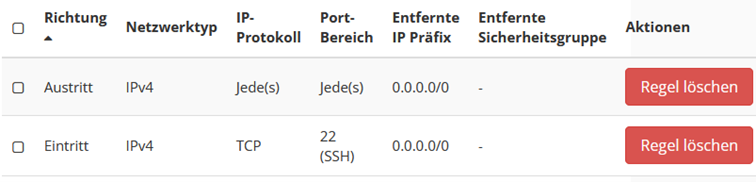
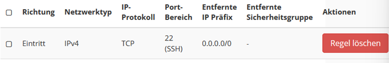
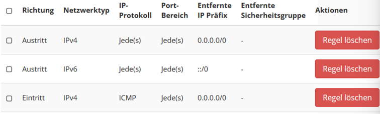
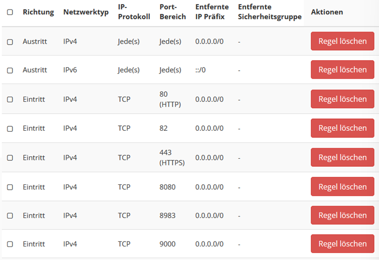
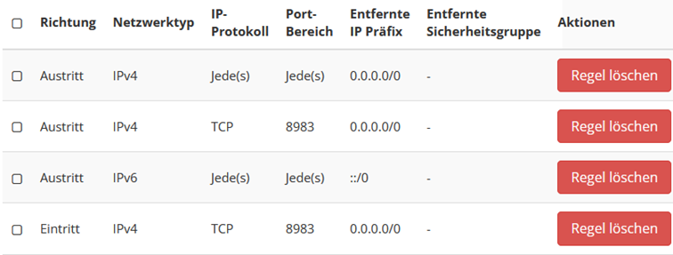

# Technische Dokumentation

## Server Setup

The BUA-VIVO project uses a total of 3 live servers and a test server.

All servers are located in the HU OpenStack

*   Link: [https://host.hu-berlin.de/auth/login/?next=/](https://host.hu-berlin.de/auth/login/?next=/)
*   Unlocked through the [OpenStack Team](mailto:mschmidt@cms.hu-berlin.de)

### Server details

1.  BUA-VIVO
    1.  m1.large
    2.  8 GB RAM
    3.  4 VCPU
    4.  80 GB Festplattenspeicher
2.  SolR
    1.  M1.small
    2.  2 GB RAM
    3.  1 VCPU
    4.  20 GB Festplattenspeicher
3.  Datenverarbeitung
    1.  m1.medium
    2.  4 GB RAM
    3.  2 VCPU
    4.  40 GB Festplattenspeicher

### Server access

The servers can be reached from the HU network via SSH after they have been assigned a floating IP.

```text
ssh ubuntu@141.20.184.XXX
```

After agent forwarding is activated (see SSH config), connections can be established to servers without floating IP. If WSL is used, the SSH agent must be evaluated beforehand

Für WSL:

```text
eval $(ssh-agent)
```

After activating agent forwarding:

```text
Nutzer@DESKTOP:~$ ssh ubuntu@141.20.184.XXX
debian@VIVO-Server:~$ ssh ubuntu@192.168.10.XXX
```

### Server Installation

The basic setup of the server is done via the Open-Stack website.

The OS on all servers is Ubuntu. See specifications above.

Set the first SSH rules via OpenStack.

Attach floating IPs to the Vivo and DV servers

#### Port release

*   ssh\_group


*   default security group


*   ping\_group


*   apache\_tomcat


*   solr


#### Updates

The Debian OS on the OpenStack servers is not up-to-date. The operating system and programs must be updated before first use.

```text
sudo apt update
sudo apt upgrade
sudo apt-get update
sudo apt-get upgrade
```

#### Additional SSH keys and SSH config

The SSH folder is in the user folder, but is hidden

```text
cd ~/.ssh
```

Additional SSH keys must be added to the authorized-keys. Nano is pre-installed and can be used to open the file. Simply copy the keys into it.

```text
nano ~/.ssh/authorized_keys 
```

SSH forwarding must be activated in the SSH config in order to be able to access servers in the subnet:

```text
nano ~/.ssh/config
```

Insert the following:

```text
Host 192.168.10.*
    ForwardAgent yes
    AddKeysToAgent yes
```
