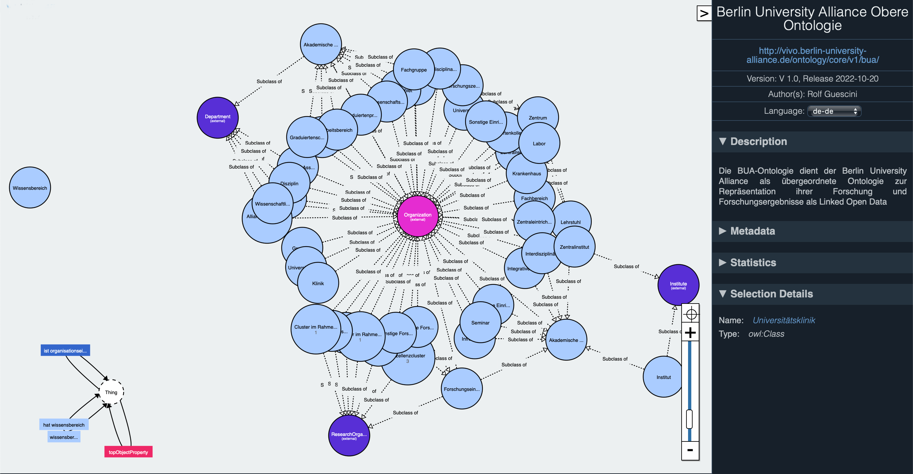
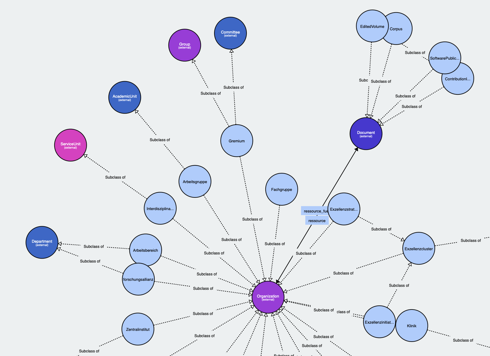

# Berlin University Alliance Upper Ontology

The Berlin University Alliance (BUA) Upper Ontology is an ontology that describes classes of entities in the shared academic domain of the Alliance members.

*Fig 2: Overview of the Berlin University Alliance Upper Ontology*.

The image above shows a graphic visualisation of the Upper ontology, which describes mostly organisational structures in the common domain of the alliance.
The BUA upper ontology itself subclasses the VIVO ontology as well as other ontologies dependant of which the VIVO ontology is dependant on. Such as the [FOAF](http://xmlns.com/foaf/0.1/) ontology, the [OBO BFO ontology](https://ontobee.org/ontology/BFO)	and the [SKOS ontology](https://www.w3.org/2009/08/skos-reference/skos.html)

As we can see from the graph, most entities subclass `foaf:organization`, in the same way as each entity of the member ontologies will subclass the BUA upper ontology classes.

In addition to to the organisational entities, the BUA upper ontology also defines, as we see in Fig2, resource types, not already found in the VIVO ontology or its depency ontologies.

*Fig2: Details view of upper ontology*

In addition to the classes, the upper ontology also contains Object [Properties](https://www.w3.org/TR/owl-ref/#Property) which make out the relation types used to relate entities together within a sertain semantic function as well as data properties making up metadata fields on the class instances.

The Ontology is developed using the [Ontology Development Kit](https://github.com/INCATools/ontology-development-kit) which contains the ontology expressed in Functional OWL syntax as well as serialization in several formats.

The code is published in the [https://github.com/BUA-VIVO/bua-upper-ontology](https://github.com/BUA-VIVO/bua-upper-ontology) repository