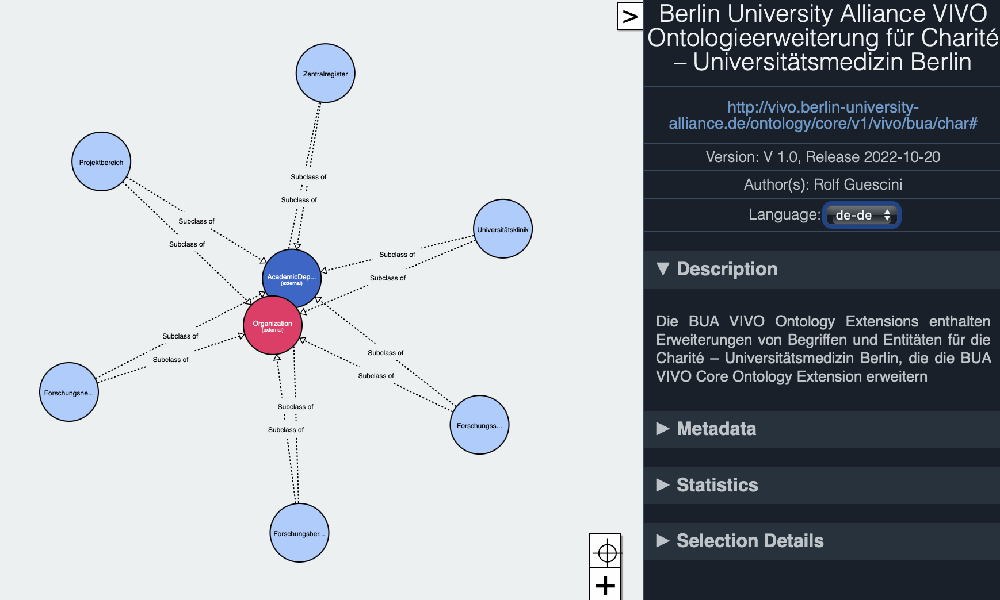

# Charité University Hospital Ontology Extension

[Ontology On Github](https://raw.githubusercontent.com/BUA-VIVO/bua-vivo-ontology-extensions/main/vivo-bua-ext-charite.rdf)

The Charité University Hospital Ontology Extension was created on basis of the [Organigram diagram](https://www.charite.de/fileadmin/user_upload/portal/charite/organisation/download/organigramm/Organigramm.pdf) and by manually analyzing the institutional structures of the [Charité Centres](https://www.charite.de/die_charite/charitecentren/), representing the organization of teaching, research and patient care. The analysis was done while building the [Charité organizational ontology](https://raw.githubusercontent.com/BUA-VIVO/bua-organigram/main/char.ttl), identifying the entities idiosyncratic to the Charité domain.

*Fig 1: Charité VIVO Ontology Extension*

Fig 1 shows a diagrammatic representation of the Ontology extensions with entities particular to the domain, all subclassing the classes *foaf:Organization* from the [FOAF ontology](http://xmlns.com/foaf/0.1/#term_Organization) and *vivo:AcademicDepartment* from the [VIVO ontology](https://raw.githubusercontent.com/vivo-project/VIVO/main/home/src/main/resources/rdf/tbox/filegraph/vivo.owl) 