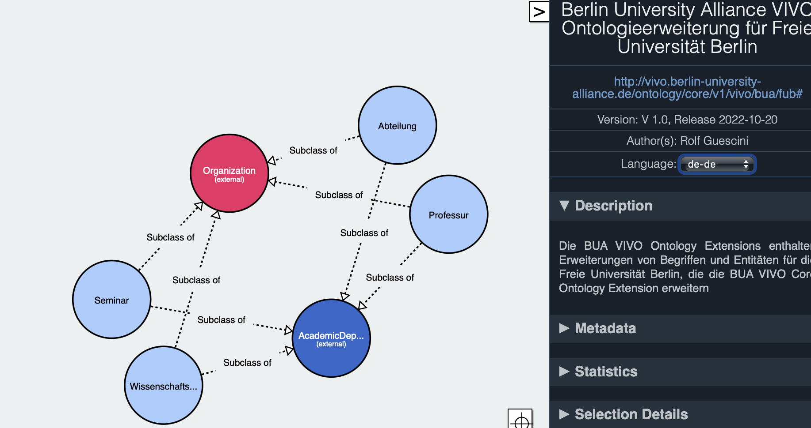

# Freie Universität Berlin Ontology Extension

[Ontology On Github](https://raw.githubusercontent.com/BUA-VIVO/bua-vivo-ontology-extensions/main/vivo-bua-ext-freie-universitaet-berlin.rdf)

The Freie Universität Berlin (FUB) Ontology Extension was created on basis of the [Organigram diagram](https://www.charite.de/fileadmin/user_upload/portal/charite/organisation/download/organigramm/Organigramm.pdf) and by manually analyzing the institutional structures of the [Fachbereiche der Freien Universität Berlin](https://www.fu-berlin.de/einrichtungen/fachbereiche/index.html), representing the organization research within the institution. The analysis was done while building the [Freie Universität Berlin organizational ontology](https://raw.githubusercontent.com/BUA-VIVO/bua-organigram/main/fub.ttl), identifying the entities idiosyncratic to the Freie Universität Berlin (FUB) domain.

*Fig 1:  Freie Universität Berlin VIVO Ontology Extension*

Fig 1 shows a diagrammatic representation of the Ontology extensions with entities particular to the domain, all subclassing the classes *foaf:Organization* from the [FOAF ontology](http://xmlns.com/foaf/0.1/#term_Organization) and *vivo:AcademicDepartment* from the [VIVO ontology](https://raw.githubusercontent.com/vivo-project/VIVO/main/home/src/main/resources/rdf/tbox/filegraph/vivo.owl) 

The ontology is to be regarded as a living mapping of the entities particular to the domain, and should be revised regularly to ensure that any changes to the structure is regsitered and updated.