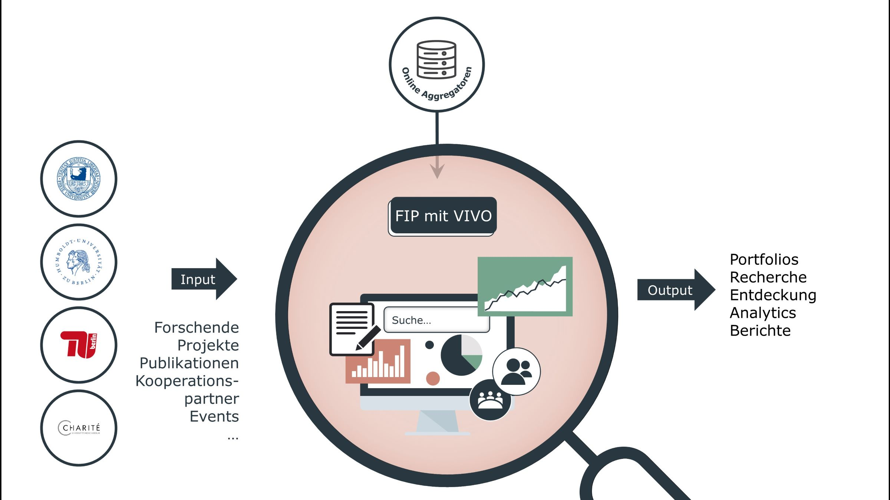

# VIVO-based Research Information Platform for the Berlin University Alliance
We are developing a platform for presenting structured, transparent, categorized, and linked information about researchers and
their research activities within the framework of the Berlin University Alliance (BUA). BUA was founded 2018 by four Berlin universities; 
the Humboldt University of Berlin, the free university of Berlin, The technical university of Berlin, and the Charité (university hospital). 
This platform aims at improving the discoverability of expertise, connecting researchers to their work across disciplines and boundaries, and facilitating new
research collaborations. The platform is established using the open-source, web-based VIVO software.

## Funder and Duration
This project is funded by the Federal Ministry of Education and Research (BMBF) and the state of Berlin under the Excellence
Strategy of the Federal Government and the Laender. The current phase runs for 2.5 years, until December 31, 2023.

### Useful Links
Project [website](https://www.berlin-university-alliance.de/en/commitments/sharing-resources/vivo/index.html)  
Project works on [Zenodo](https://doi.org/10.5281/zenodo.10212954)