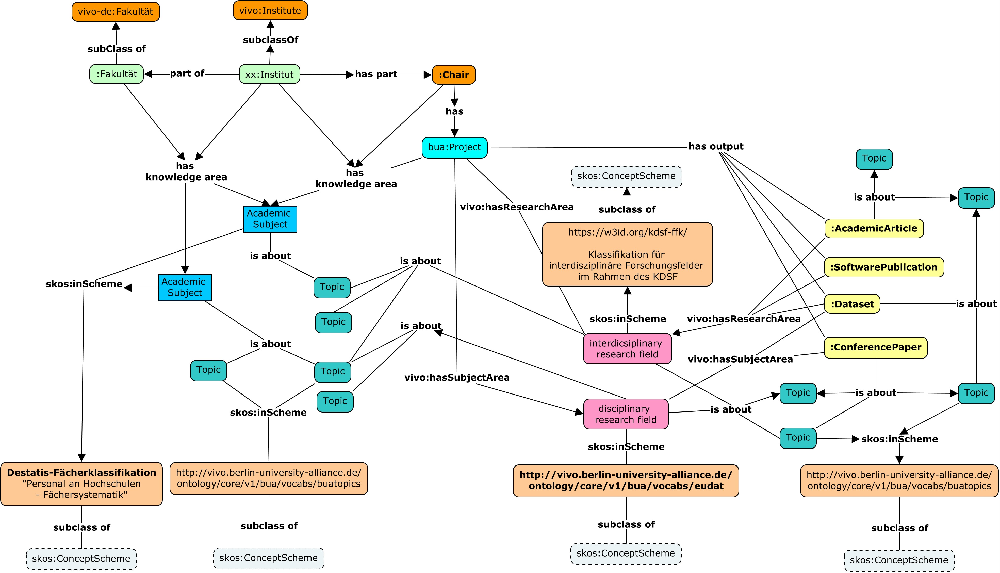

# Ontologies
Ontologies, in the context of computer science, are defined as "formal representation of concepts, their attributes and relations between them within a specific domain."

Within the Berlin University Alliance (BUA) and the framework of the BUA-VIVO project, we needed to develop and extend ontologies, as an essential part of building a research information platform for collecting, harmonizing and presenting researchers, their research as well as research activities within member universities of the BUA and across bounederies, using the Linked Open Data software, VIVO.

[VIVO](https://github.com/vivo-project/VIVO) and more specifically [VITRO](https://github.com/vivo-project/Vitro) is software based on and using Ontologies, originally representing and describing the American academic domain. As the research entities and the terms used to describe them in the American academic domain significantly diverge and may also be ambigous with respect to the corresponding German (also European) academic domain, a large part of the work within the BUA-VIVO project has been dedicated to a mapping of the German academic domain ontologies.

The challenges found in creating an ontology for the German domain on the basis of the original VIVO ontology is described in the bachelor thesis: "[Mapping und Erweiterung der Ontologie des Forschungsinformationssystems VIVO](https://doi.org/10.25968/opus-803)", and parallely, some work has already been done by the [VIVO-DE group](https://github.com/VIVO-DE/vivo-de-ontology-extension). 

The VIVO-DE group redifined topics like "Faculty", which, in the American domain is the teaching staff, i.e. the entire group of teachers. While a "Fakultät" at a German university is an organizational unit for the thematic structure of chairs. A professor in the American domain is a teacher, whereas a German professor is (generally) a head of an institute or department.

With the previous work as a basis, we extended the VIVO ontology with multiple topics through our work in analyzing the "Organigrams" (organisational diagrams) of each member organization. Structurally, the organizational structures would be quite similar, but semantically, the wording, and sometimes the functional meaning of the units would be quite different. To ensure that plurality and local varieties are kept, we needed to take into account that each alliance member would need to use and find research information related to their own terminology. 

To achieve this, we created an upper ontology with common, more abstract classes and an ontology for each member, containing instantiations of common classes retaining local names and idiosyncrasies.	

*Fig. 1: Alliance member subsumption hierarchy*.

With the ontology classes in place, the next steps is creating the knowledge graph representing alliance scientists, projects  and research ouput, by instantiating classes from the VIVO ontologies.

*Fig. 2: Alliance member subsumption hierarchy*.

In Fig. 2, we see that alongside the organizational ontology and the member university ontology extensions, their projects, research results and publications are represented. 
In some cases instantiating classes from the Core VIVO ontology, but also extension classes for Research output types not already existent in the core ontology.

The Organizational structures are partially klassified by the use of subject matters from the German national [DESTATIS](https://www.destatis.de/DE/Methoden/Klassifikationen/Bildung/studenten-pruefungsstatistik.html) Vocabulary in order to create a more ample semantic context for the machine processing of the knowledge graph. In order to provide entites such as projects and project outputs the same overbridging semantic space, a collection of vocabularies describing the research domains are integrated.

*Fig. 3: Horisontal dimension; overbridging Vocabularies*.

Specifically, the [EUDAT B2FIND Disciplinary Research Vocabulary
](https://github.com/BUA-VIVO/eudat-b2find-skos) and the [Kerndatensatz Forschung Interdisciplinary Research Vocabulary]([https://github.com/guescinr/kdsf-ffk_translated](https://github.com/guescinr/kdsf-ffk_translated)).
These are used to classify research output, including Publications of different types as well as Projects in order to collocate them according to their research foci.

The standards CERIF and KDSF standards have still not bin integrated, as they are part of a possible future extension of the project.

*Fig. 4: Classification of Ontology entities; overbridging Vocabularies*.

Fig. 4 is a diagram showing the subsumption hierarchy of the institutional structures, their classification, as well as the relation between vocabularies and projects and research output.
The vocabularies add an additional layer of semantic space for the ontology and its instances in order to make automatic classification possible. Topics were then extracted from the different vocabularies, defining a semantic space for the vocabulary terms which in themselves are far to generic to be of any use for automatic classification.

The topics form a alliance wide vocabulary of research topics which can be assigned to the the instances, adding yet another viewpoint and level of metadata to optimize the machine computability of search and findability within the alliance knowledge graph.

