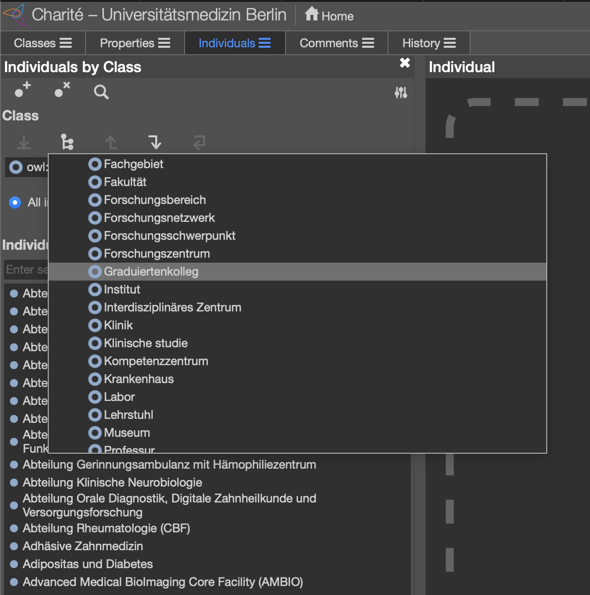
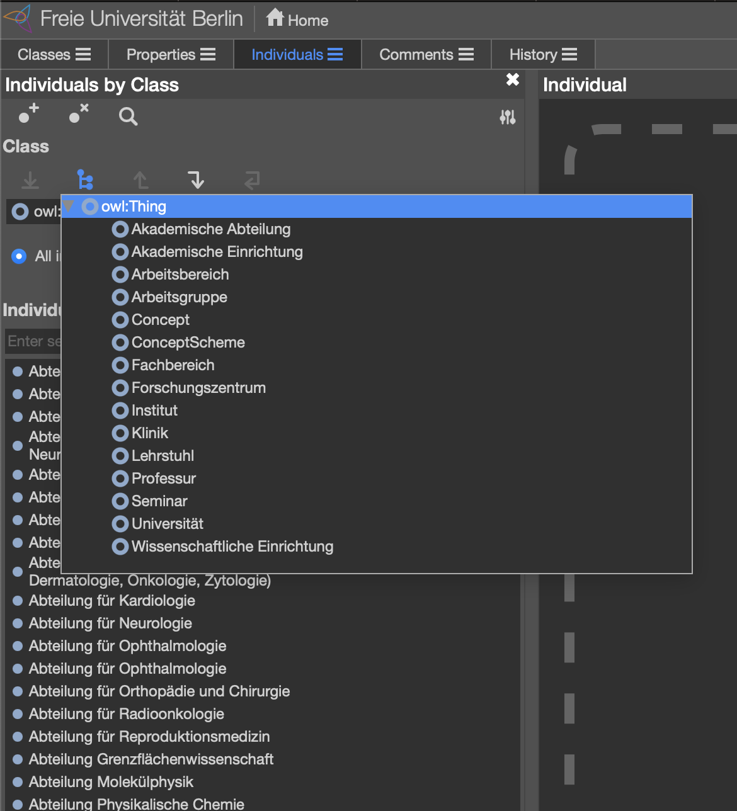
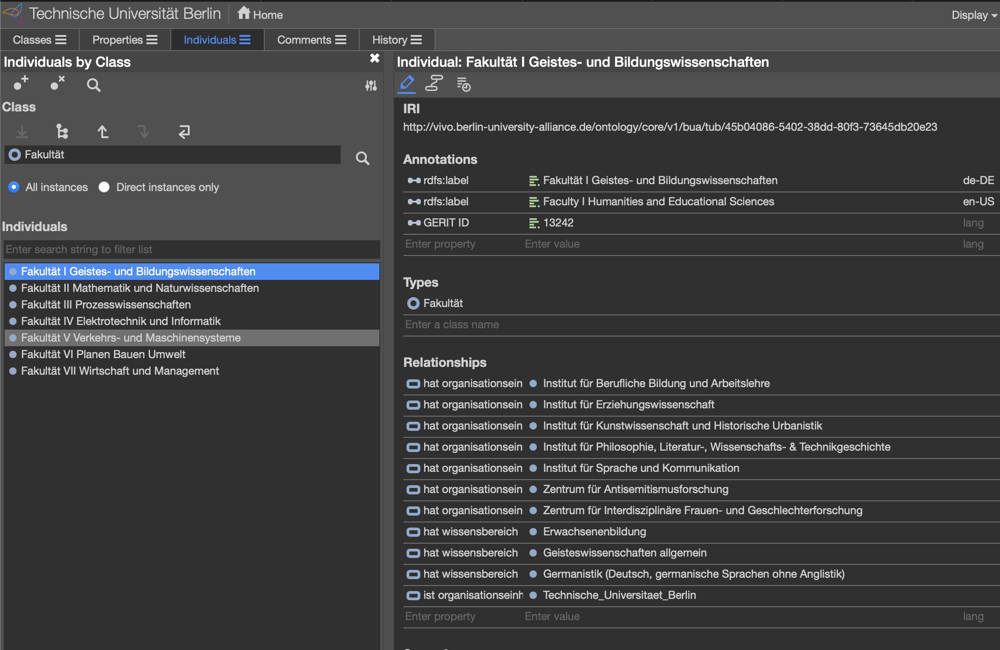

# Organigram ontologies

[Code on GitHub](https://github.com/BUA-VIVO/bua-organigram)

The Berlin University Alliance consists of 3 universities and one University Hospital, where the universities have conceptually similar structures, but also diverge on many points. Sometimes in terms of structure other times in the terms of the naming of similar structureCode on GitHubs. The University hospital diverges on all points, for all of them there was a need to represent these structures in a formal ontology, in order to facilitate the assignment and relation of research output and their creators to the member institutions.

The source of information for the Organigram ontologies were different from institution to institution, as some of the institutions would have a dedicated document diagramming the main structural units, ins one case the only source were the web sites of the university, in only one case there was a dedicated API connected to a central administrative system.
In most cases, the work of creating the ontologies entailed manual work, as the de facto structures would often diverge from the diagrams given and sometimes be quite inconsistent as well.

The ontologies were initially created without help of domain experts, as the ontologies are intended as living ontologies to be managed and updated by the domain experts within each institution.

The Organigram ontology consists of instantiations of classes from the BUA-VIVO Upper Ontology, object properties representing the hierarchical structure of the institutions as well as object properties relating subject matters from the German national [DESTATIS](https://www.destatis.de/DE/Methoden/Klassifikationen/Bildung/studenten-pruefungsstatistik.html) Vocabulary.
In addition, in some cases, data properties to allow for categorization with identifiers from the [GERIT](https://gerit.org/en/about) research landscape portal.

The resulting ontologies are thought to be available for continuous update through ontology editors such as [Protegé](https://protege.stanford.edu/software.php) allowing for an easier end user experience in managing the ontologies

Fig 1, shows us a view of the Classes found in the Charité organigram. Since it is a University hospital we see several Classes similar to for instance the Classes in Fig 2., while containing other classes specific to the University Hospital domain, subclassing entities from the VIVO ontology extensions representative of its domain.

*Fig 1: Charité Protegé class view*

As we see in Fig 2, there are some classes which bear the same names as classes in Fig 1, which might, in some cases, mean that they have the same semantic meaning and function, most often they diverge to a variable degree. At the same time there are classes which have dissimilar or partly similar names which might have a closer semantic and functional resemblance, which from the naming alone is not possible to infer.

*Fig 2: Freie Universität Berlin Protegé class view*

As some of the goals of the Berlin University Alliance is Expertise and Knowledge Exchange between the alliance members, and specifically in the context of the BUA-VIVO project, the Sharing of Resources and Open Access Research Data Management, there is a need to be able to collocate across the institutional entities in order to facilitate a more accurate and relevant exchange between institutions and their researchers.

The organisation ontology itself maps and represents the hierarchical and vertical dimension of the institutions themselves. But for machines to infer that entities in the different ontologies are similar or do research on similar research fields it is not trivial unless the machines have access to further contextual information, which provide more information for machine based automatic matching of entities. To this extent, the in addition to the BUA ontologies, we use selected vocabularies as an additional dimension, weaving the different entities in the ontologies together.

Figure 3, shows the first layer, implemented by relating entities to subject matters from the DESTATIS vocabulary

*Fig 3: Technische Universität Berlin Protegé detail view*

The DESTATIS subject matter classification is programatically assigned to the enitites in the organigram ontologies based on a simple pattern matching algorith, which in the end resulted in a partial assignment of subject matters to the insitutional entities, which need manual interaction by domain experts in order to be proof read and completed for each alliance member organigram.

:smile:
:mdiSkipNext:
