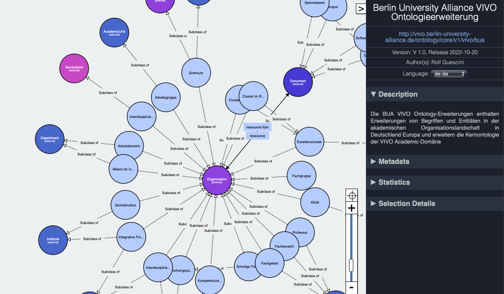

# Berlin University Alliance (BUA) VIVO CORE ONTOLOGY EXTENSION

[Ontology On Github](https://raw.githubusercontent.com/BUA-VIVO/bua-vivo-ontology-extensions/main/vivo-bua-ext.rdf)

The Berlin University Alliance (BUA) VIVO Ontology Extension created on basis of the [Technische Universität Berlin Organigram diagram](https://www.static.tu.berlin/fileadmin/www/10000000/Ueber_die_TU_Berlin/Organisation/Organigramm/Organigramm_TUBerlin.pdf) and the [Humboldt-Universität zu Berlin Organigram diagram](https://www.hu-berlin.de/de/einrichtungen-organisation/organigramm) and by manually analyzing the institutional structures of the [Technische Universität Berlin Fakultäten & Zentralinstitute](https://www.tu.berlin/ueber-die-tu-berlin/organisation/fakultaeten-zentralinstitute) and the [Humboldt-Universität zu Berlin Zentrales Informationssystem](https://www.hu-berlin.de/de/service/zisneu/zis?ifabsessid=coi1ac4sj19v0okbskci2155hc&ifab_modus=einrichtungsbaum&zuf=cf10d706ff6aa5a4299c7635f0afdb8e), identifying the entities idiosyncratic to both domains as well as entities common to the alliance domains in general,  laying the basis for the  VIVO ontology extension

*Fig 1: BUA VIVO Ontology Extension*

Fig 1 shows a diagrammatic representation of the Ontology extensions with entities particular to the domain, all subclassing the classes *foaf:Organization* from the [FOAF ontology](http://xmlns.com/foaf/0.1/#term_Organization) and *vivo:AcademicDepartment* from the [VIVO ontology](https://raw.githubusercontent.com/vivo-project/VIVO/main/home/src/main/resources/rdf/tbox/filegraph/vivo.owl)

The ontology is to be regarded as a living mapping of the entities particular to the domain, and should be revised regularly to ensure that any changes to the structure is regsitered and updated.
