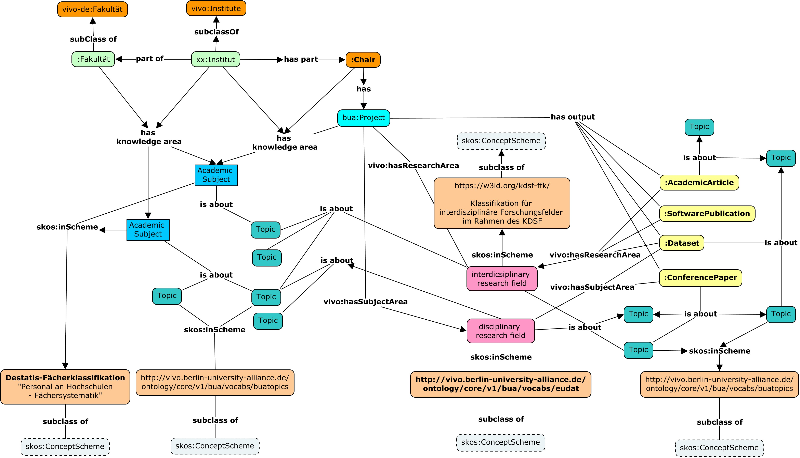

# Vocabularies 

The vocabularies used in the Berlin University Alliance (BUA) VIVO project, are used not only to classify publications and other research outputs, but also carry the role of creating a more ample semantic context for the machine readability of the ontologies and the knowledge graphs. The vocabularies and the alliance wide research topic vocabulary, and the assignment of these to outputs as well as projects andinstitutional structures, form a network bridging semantically diverging entities.

Querying and traversing the knowledge graph, it is possible to make inferences to the similarity of otherwise divergent entities assuming that their semantic likeness can be inferred across them being classified under the same themes and vocabulary topics.

*Fig. 1: Classification of Ontology entities; overbridging Vocabularies*.

Fig. 1 is a diagram showing the subsumption hierarchy of the institutional structures, their classification, as well as the relation between vocabularies and projects and research outputs in the BUA knowledge graph
The vocabularies add an additional layer of semantic space for the ontologies and its instances in order to make automatic classification possible. Topics were then extracted from the different vocabularies, defining a semantic space for the vocabulary terms which in themselves are far to generic to be of any use for automatic classification.

## Fächersystematiken des Statistischen Bundesamtes (DESTATIS)

https://www.destatis.de/DE/Methoden/Klassifikationen/Bildung/personal-stellenstatistik.pdf?__blob=publicationFile

https://raw.githubusercontent.com/BUA-VIVO/destatis_faecherklassifikation_translation_service/master/faecherklassifikation_skos_en.ttl

## eudat-b2find Disciplinary Research Vocabulary
https://raw.githubusercontent.com/BUA-VIVO/eudat-b2find-skos/main/eudat.ttl

## Interdisciplinary research field classification

https://skohub.io/KDSF-FFK/kdsf-ffk/heads/main/w3id.org/kdsf-ffk/index.de.html

